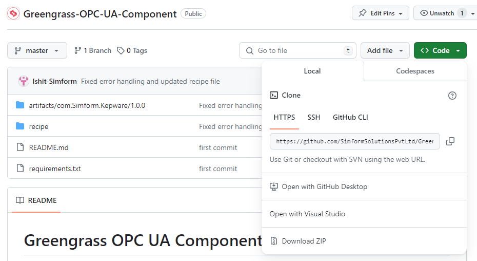
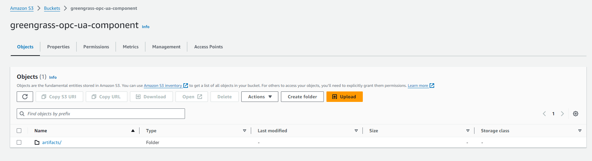
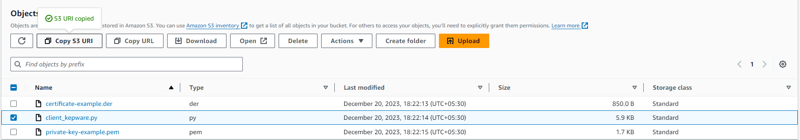
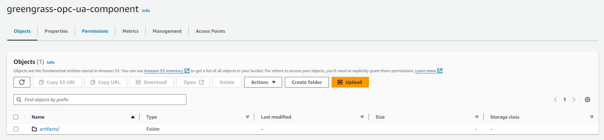
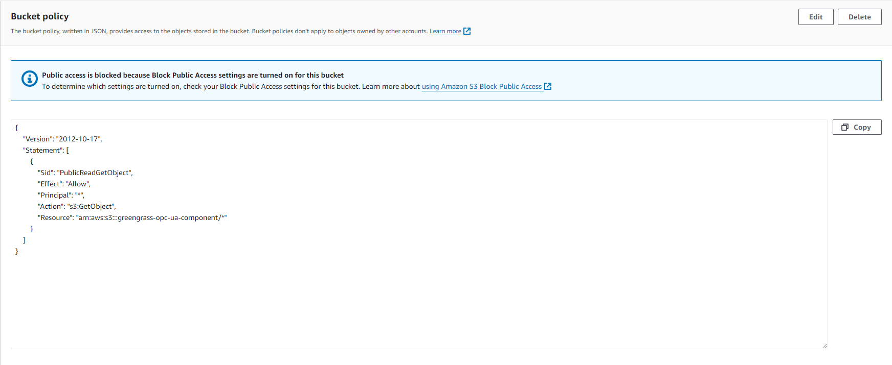
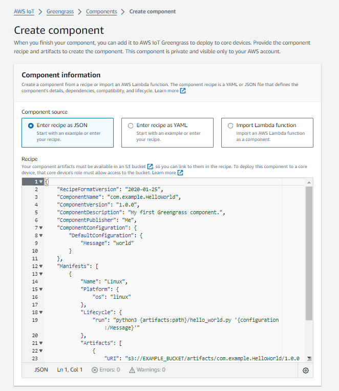

# Greengrass OPC UA Component

This component provides the ability to read data from OPC UA Server using OPC UA protocol and publish it to AWS IoT Core.<br>

## Installation

Configure the recipe template and deploy the component to greengrass core device.

### Recipe configuration

Edit the following placeholders in recipe template.

- `<policy>`: Policy could be ``Basic128Rsa15``, ``Basic256`` or ``Basic256Sha256``.
- `<security_mode>`: Security Mode could be ``Sign`` or ``SignAndEncrypt`` or ``None``.
- `<certificate_path>`: Specify the full path of certificate.
- `<privatekey_path>`: Specify full path of private key.
- `<kepware_endpoint>`: Specify Kepware endpoint mentioned in Kepware Configuration.
- `<kepware_name>`: Specify name of kepware channel name that consists devices.
- `<topic>`: Specify IoT Core MQTT topic to publish the data.
- `<devices>`: You could list multiple devices with device name and parameters.
    - `<device_name>`: Unique device name as specified in Kepware.
    - `<parameters>`: Parameters of this device as specified in Kepware.

## Usage

#### Example
```
{
  "RecipeFormatVersion": "2020-01-25",
  "ComponentName": "com.Simform.Kepware",
  "ComponentVersion": "1.0.0",
  "ComponentDescription": "A component that publishes messages.",
  "ComponentPublisher": "Amazon",
  "ComponentConfiguration": {
    "DefaultConfiguration": {
      "policy": "Basic256Sha256",
      "security_mode": "SignAndEncrypt",
      "certificate_path": "/home/pi/certificate-example.der",
      "privatekey_path": "/home/pi/private-key-example.pem",
      "kepware_endpoint": "opc.tcp://127.0.0.1:49320/KEPServerEX/", 
      "kepware_name": "PLC_simulator_script",  
      "topic": "my/topic",    
      "devices": [
        {
          "device_name": "Device1",          
          "parameters": [
            "Tension pot position",
            "Nip Pressure",
            "Mercerisation Bath Temp",
            "Mercerisation Bath pH",
            "Hot bath Temp",
            "Hot bath pH",
            "Cold bath Temp",
            "Cold bath pH",
            "Dye Dosage",
            "Hydro Dosage",
            "Steam Pressure",
            "Waste water out flow",
            "Rope Out Speed",
            "Mercerisation Bath",
            "Mercerisation Hot Bath",
            "Mercerisation Cold Bath",
            "Mercerisation Bath Hydro concetration",
            "Mercerisation Hot Bath Hydro concetration",
            "Mercerisation Cold Bath Hydro concetration",
            "Totalizer",
            "Rinse cycle",
            "Dye bath Filteration"
          ]
        },
        {
          "device_name": "Device2",          
          "parameters": [
            "Dancer Position",
            "Beam Length Meter",
            "Speed",
            "Comb Acentric",
            "Strummer",
            "Air blower",
            "Lease string detector",
            "Accumulator Motor"            
          ]
        }
      ],
      "accessControl": {
        "aws.greengrass.ipc.mqttproxy": {
          "com.example.Kepware:mqttproxy:1": {
            "policyDescription": "Allows access to publish to all topics.",
            "operations": [
              "aws.greengrass#PublishToIoTCore",
              "aws.greengrass#SubscribeToIoTCore"
            ],
            "resources": [
              "*"
            ]
          }
        }
      }
    }
  },
  "Manifests": [
    {
      "Platform": {
        "os": "linux"
      },
      "Lifecycle": {
        "install": "python3 -m pip install --user awsiotsdk asyncua==1.0.5 pyopenssl==23.3.0 cryptography==41.0.5",
        "run": "python3 -u {artifacts:path}/client_kepware.py '{configuration:/devices}' '{configuration:/kepware_name}' '{configuration:/kepware_endpoint}' '{configuration:/policy}' '{configuration:/security_mode}' '{configuration:/certificate_path}' '{configuration:/privatekey_path}' '{configuration:/topic}'"
      },
      "Artifacts": [
            {
                "URI": "your S3 URI"
            }
        ]
    },
    {
      "Platform": {
        "os": "windows"
      },
      "Lifecycle": {
        "install": "py -3 -m pip install --user awsiotsdk asyncua==1.0.5 pyopenssl==23.3.0 cryptography==41.0.5",
        "run": "py -3 -u {artifacts:path}/client_kepware.py '{configuration:/devices}' '{configuration:/kepware_name}' '{configuration:/kepware_endpoint}' '{configuration:/policy}' '{configuration:/security_mode}' '{configuration:/certificate_path}' '{configuration:/privatekey_path}' '{configuration:/topic}'"
      },        
      "Artifacts": [
            {
                "URI": "your S3 URI"
            }
        ]
    }
  ]
}
```

## Step by Step Guide

### Step 1

Clone this repository.




### Step 2

Create S3 bucket, go to permissions and then edit bucket policy.
```
Bucket policy:
{
    "Version": "2012-10-17",
    "Statement": [
        {
            "Sid": "PublicReadGetObject",
            "Effect": "Allow",
            "Principal": "*",
            "Action": "s3:GetObject",
            "Resource": "arn:aws:s3:::greengrass-opc-ua-component/*"
        }
    ]
}
```

Now upload artifacts folder and copy S3 URI of client_kepware.py by navigating into "artifacts/com.Simform.Kepware/1.0.0/"










### Step 3

Create greengrass component. 
Copy recipe from recipe/com.Simform.Kepware-1.0.0.json given in repository or copy it from this readme file in example section.

Note: Remember to configure all the parameters in recipe before creating component.
Here are all the parameters (refer Recipe configuration for detailed information)
- `<policy>`
- `<security_mode>`
- `<certificate_path>`
- `<privatekey_path>`
- `<kepware_endpoint>`
- `<kepware_name>`
- `<topic>`
- `<devices>`
    - `<device_name>`
    - `<parameters>`




### Step 4

Now component is ready to be deployed in core device.


